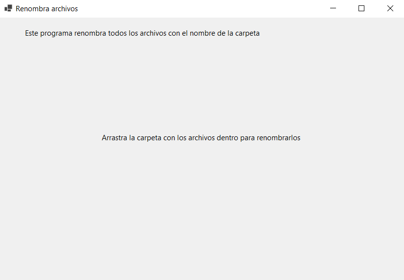

# Folder Files Renamer Desktop

Herramienta de escritorio desarrollada en C# para el renombrado masivo de archivos basado en el nombre de su carpeta contenedora. Ideal para organizar colecciones de datos, fotos o documentos de forma automática.

## ✨ Características

- **Renombrado masivo**: Renombra todos los archivos dentro de un directorio con un solo clic.
- **Basado en la carpeta contenedora**: Utiliza el nombre de la carpeta que contiene los archivos como base para el nuevo nombre.
- **Interfaz sencilla**: Una aplicación de escritorio fácil de usar para Windows.
- **Código abierto**: Incluye el código fuente completo para que puedas estudiarlo o modificarlo.

## 🚀 Cómo usar

1.  Descarga el archivo ejecutable desde la sección de [Releases](https://github.com/MauricioBelforte/folder-files-renamer-desktop/releases/tag/v1.0.0).
2.  Ejecuta el programa.
3.  Arrastra y suelta la carpeta que contiene los archivos sobre la ventana de la aplicación.
4.  ¡Listo! Los archivos serán renombrados siguiendo el patrón `NombreDeLaCarpeta-1`, `NombreDeLaCarpeta-2`, etc.

## 🛠️ Desarrollo (Building from Source)

Si deseas compilar el proyecto tú mismo, sigue estos pasos:

1.  Clona o descarga este repositorio.
2.  Abre la solución (`.sln`) con Visual Studio.
3.  Asegúrate de tener el workload de desarrollo de escritorio de .NET instalado.
4.  Compila el proyecto (Build > Build Solution). El ejecutable se encontrará en la carpeta `bin/Debug` o `bin/Release`.

## 📄 Licencia

Este proyecto está bajo la Licencia MIT. Consulta el archivo `LICENSE` para más detalles.
